# Newt Compiler — Deep Dive Guide

A visual and conceptual guide to how the Newt compiler works, from source code to pixels (or HTML).

---

## Production contract

All consumers (CLI, serve, Canvas IDE, LSP, wgpu app) use the same behavior:

1. **Single entry:** `compile(source, path, screen_name?) -> Result<(Program, LayoutNode), NewtError>` in the compiler library. It (1) parses, (2) resolves imports when `path` is `Some`, (3) builds `EvalContext`, (4) resolves the requested screen, (5) runs `layout_tree` on the screen body. Use this instead of calling `parse`, `resolve_imports`, and `layout_tree` separately.

2. **Imports:** When a file path is provided, `resolve_imports` is run. Without a path (e.g. unsaved buffer), imports are not resolved and import errors will not be reported until the document is saved with a path. The LSP uses the document URI’s file path so import and circular-import errors appear as diagnostics.

3. **Viewport:** The layout tree from `compile()` is computed with viewport `(0, 0, 960, 640)` (constants `DEFAULT_VIEWPORT_W`, `DEFAULT_VIEWPORT_H`). The Canvas IDE and HTML export use this size unless overridden. The wgpu app may recompute layout with the actual window size after compile.

4. **Layout JSON (IDE / clients):** The payload sent to the Canvas IDE (and from `/api/layout`, `/api/compile`) has this shape:
   - `type`: `"layout"` (or `"error"` with `message` on failure).
   - `screens`: array of screen names (strings).
   - `screen`: name of the screen that was laid out.
   - `viewport`: `{ "w": 960, "h": 640 }`.
   - `root`: the root `LayoutNode` (see [Key Data Structures](#7-key-data-structures)) with `kind`, `rect`, `fill`, `stroke`, `radius`, `text`, `font_size`, `children`, etc.

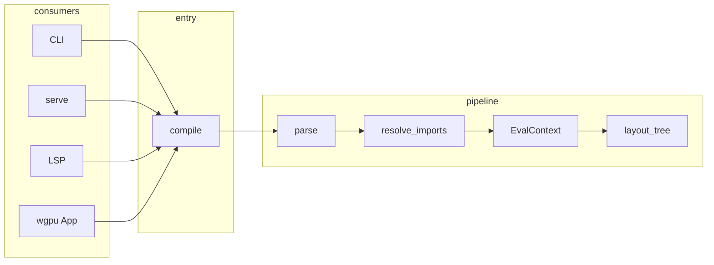

### Layout JSON schema (IDE and clients)

The payload sent to the Canvas IDE and from `/api/layout` and `/api/compile` has this shape:

**Root object:**

| Field     | Type   | Description |
|----------|--------|-------------|
| `type`   | string | `"layout"` on success; `"error"` with `message` on failure |
| `screens`| string[] | List of screen names in the program |
| `screen` | string | Name of the screen that was laid out |
| `viewport` | `{ w: number, h: number }` | Viewport size (default 960×640) |
| `root`   | LayoutNode | Root of the layout tree |

**LayoutNode:**

| Field | Type | Description |
|-------|------|-------------|
| `kind` | string | One of: Box, Text, Row, Column, Grid, Stack, Center, Spacer, Image, Button, Input, Modal |
| `rect` | `{ x, y, w, h }` | Bounds (numbers) |
| `fill` | `[r,g,b,a]` or null | Fill color |
| `stroke` | `[r,g,b,a]` or null | Stroke color |
| `stroke_width` | number or null | Border width |
| `radius` | number | Corner radius |
| `text` | string or null | Text content |
| `font_size` | number | Font size |
| `font_weight` | string or null | Font weight |
| `shadow` | number or null | Shadow blur/offset |
| `transition_ms` | number or null | Transition duration (ms) |
| `role` | string or null | ARIA role |
| `aria_label` | string or null | ARIA label |
| `focus_order` | number or null | Tab order |
| `onClick` | string or null | Event hint (data-on-click) |
| `href` | string or null | Link hint (data-href) |
| `name` | string or null | Input name |
| `aspect_ratio` | number or null | Aspect ratio |
| `children` | LayoutNode[] | Child nodes |

Optional **patch** format for incremental updates (e.g. replace/insert/delete node at path) can be added in a later revision so clients can update the canvas without full redraw.

---

## Table of Contents

1. [The Big Picture](#1-the-big-picture)
2. [Stage 1: Lexer (Source → Tokens)](#2-stage-1-lexer-source--tokens)
3. [Stage 2: Parser (Tokens → AST)](#3-stage-2-parser-tokens--ast)
4. [Stage 3: EvalContext (AST → Runtime Context)](#4-stage-3-evalcontext-ast--runtime-context)
5. [Stage 4: Layout (AST + Context → Layout Tree)](#5-stage-4-layout-ast--context--layout-tree)
6. [Stage 5: Render (Layout Tree → GPU or HTML)](#6-stage-5-render-layout-tree--gpu-or-html)
7. [Key Data Structures](#7-key-data-structures)
8. [Example: End-to-End Walkthrough](#8-example-end-to-end-walkthrough)
9. [How to View the Flowcharts](#9-how-to-view-the-flowcharts)

---

## 1. The Big Picture

The compiler is a **linear pipeline**: each stage consumes the output of the previous one. There are two final outputs: **wgpu window** (live canvas) or **HTML file** (static export).

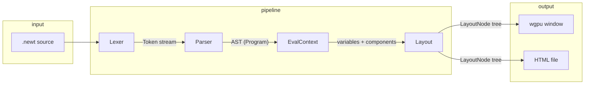

**Detailed pipeline (what each stage does):**

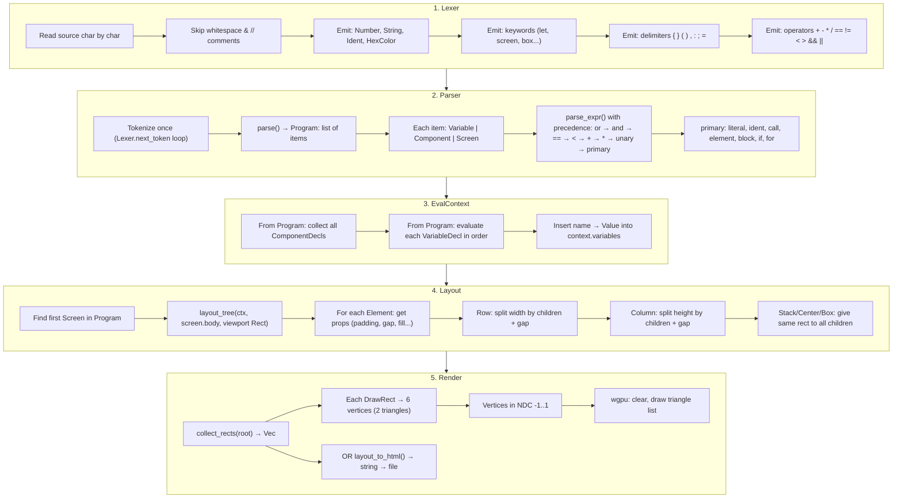

---

## 2. Stage 1: Lexer (Source → Tokens)

The lexer reads the source string **once**, left to right, and produces a **stream of tokens**. Each token has a **kind** and a **span** (start/end byte, line, column).

### Lexer decision flow

```mermaid
flowchart TD
    START([next_token]) --> SKIP[Skip whitespace & // comments]
    SKIP --> PEEK{Peek char}
    PEEK -->|None| EOF[Emit Eof]
    PEEK -->|"#"| HEX[read_hex_color → HexColor]
    PEEK -->|'"'| STR[read_string → String]
    PEEK -->|digit| NUM[read_number → Number]
    PEEK -->|letter or _| ID[read_ident_or_keyword]
    PEEK -->|"-" + ">"| ARR[Emit Arrow]
    PEEK -->|"=="| EQ2[Emit EqEq]
    PEEK -->|"!="| NE[Emit NotEq]
    PEEK -->|"<="| LE[Emit Le]
    PEEK -->|">="| GE[Emit Ge]
    PEEK -->|"&&"| AND[Emit And]
    PEEK -->|"||"| OR[Emit Or]
    PEEK -->|single char| SINGLE[Emit { } ( ) , . ; : = + - * / % < > !]
    PEEK -->|other| ERR[Error: unexpected char]

    ID --> KW{Reserved?}
    KW -->|let, screen, component, if, else, for, in| KTOK[Emit keyword]
    KW -->|box, text, row, column...| KTOK
    KW -->|width, fill, padding...| IDENT[Emit Ident so let padding = 24 works]
    KW -->|other| IDENT
```

### Token categories (summary)

| Category | Examples |
|----------|----------|
| **Literals** | `Number(24)`, `String("hi")`, `HexColor(r,g,b,a)`, `True`, `False` |
| **Keywords** | `Let`, `Screen`, `Component`, `If`, `Else`, `For`, `In` |
| **Element names** | `Box`, `Text`, `Row`, `Column`, `Stack`, `Center`, `Spacer`, `Image`, `Button`, `Input` |
| **Prop names** | In lexer these are emitted as **Ident** (e.g. `padding`, `fill`) so variables like `let padding = 24` work. Parser still recognizes them by string name. |
| **Delimiters** | `LeftBrace` `{`, `RightBrace` `}`, `LeftParen` `(`, `Comma`, `Colon`, `Semicolon`, `Eq` `=` |
| **Operators** | `Plus`, `Minus`, `Star`, `Slash`, `EqEq`, `NotEq`, `Lt`, `Le`, `Gt`, `Ge`, `And`, `Or`, `Not` |

---

## 3. Stage 2: Parser (Tokens → AST)

The parser is **recursive descent**: one function per grammar rule, consuming tokens via `advance()` and `expect()`.

### Top-level: Program

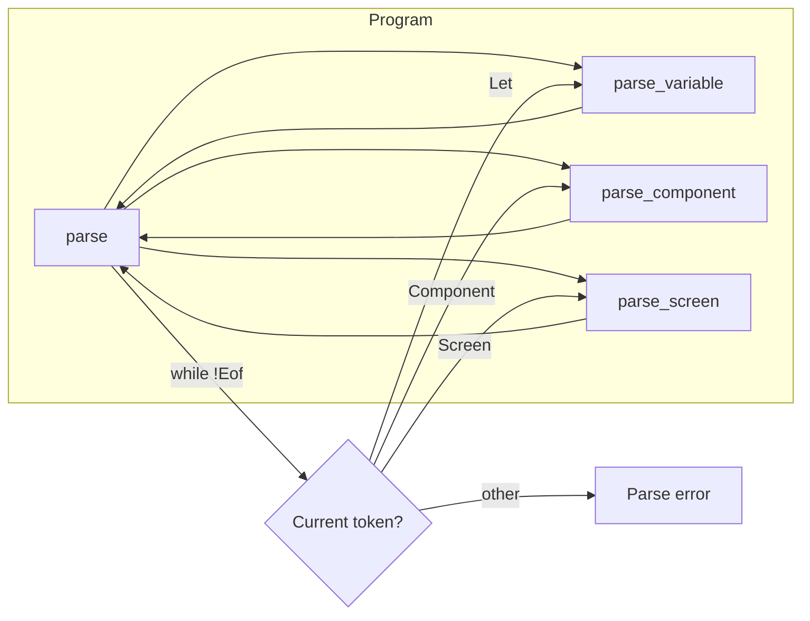

- **Variable**: `let` ident `=` expr `;`
- **Component**: `component` ident `(` params? `)` `{` expr `}`
- **Screen**: `screen` ident `{` expr `}`

### Expression precedence (low to high)

The parser uses a **precedence ladder**: lower precedence calls higher. So "or" is at the top, "primary" at the bottom.

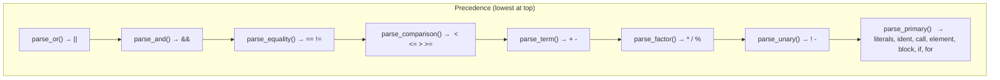

So for `a + b * c`, we get: term calls factor; factor consumes `b * c` first (higher precedence), then term adds `a` and the result.

### Primary expressions

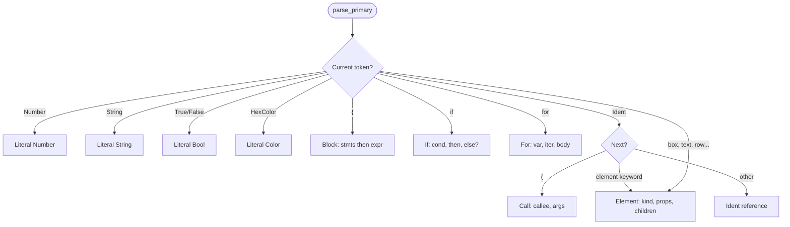

### Element parsing (props + children)

Elements look like: `box { fill: #fff, padding: 16 } { text { content: "Hi" } }` — optional props block, optional children block.

```mermaid
flowchart TD
    ELT([parse_element_props_and_children]) --> LB1{At "{"?}
    LB1 -->|yes| PROPS[While not "}": parse_prop or parse_expr]
    LB1 -->|no| CHILD
    PROPS --> LB2{At "{"?}
    LB2 -->|yes| CHILD[While not "}": parse_expr = child]
    LB2 -->|no| DONE
    CHILD --> DONE[Return Expr::Element]
```

---

## 4. Stage 3: EvalContext (AST → Runtime Context)

Before layout, we need a **runtime context**: variable names → values, and component names → definitions. Layout and expression evaluation both use this.

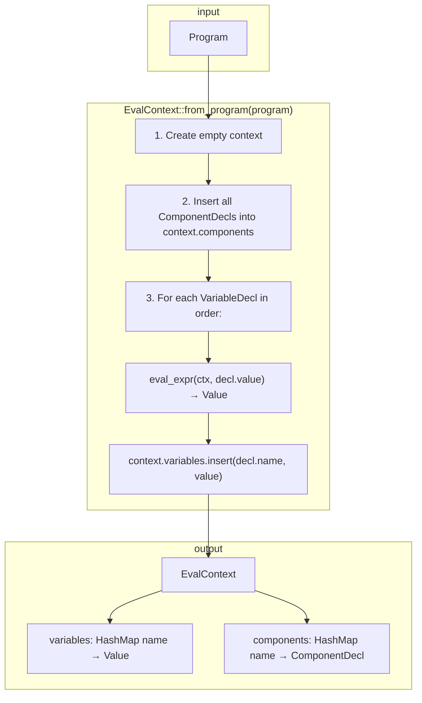

**Important:** Variables are evaluated in **program order**. So you can use a variable only after it’s defined (no forward references). Component bodies are **not** evaluated here; they are evaluated when a **Call** is seen during layout or eval.

---

## 5. Stage 4: Layout (AST + Context → Layout Tree)

Layout turns the **screen body expression** (a tree of Elements, Calls, Blocks) into a tree of **LayoutNodes**, each with a **Rect** and visual props (fill, stroke, radius, text, font_size).

### Entry point

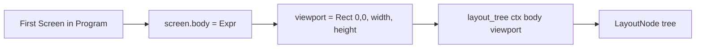

### layout_tree dispatch

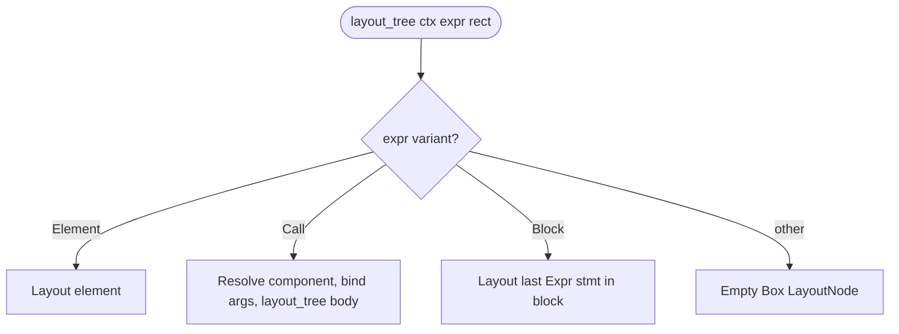

### Layout element (the core)

For `Expr::Element { kind, props, children }`:

1. **Resolve props** (using `ctx`): padding, gap, fill, stroke, radius, fontSize, content (text).
2. **Compute inner rect**: shrink `rect` by padding on all sides.
3. **Dispatch by kind** to compute child rects and recurse.

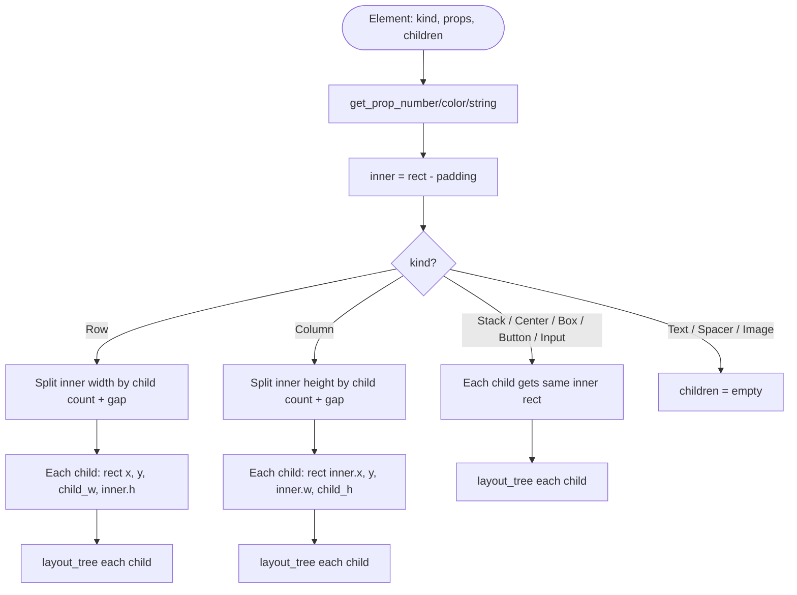

So:

- **Row**: horizontal strip; equal width per child; gap between.
- **Column**: vertical strip; equal height per child; gap between.
- **Stack / Center / Box / Button / Input**: all children get the **same** inner rect (no sizing by content yet).
- **Text / Spacer / Image**: no child nodes; text/content stored for HTML or future text renderer.

---

## 6. Stage 5: Render (Layout Tree → GPU or HTML)

### GPU path (wgpu)

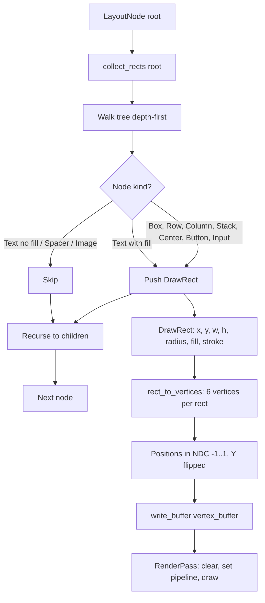

- **collect_rects**: produces `Vec<DrawRect>`. Stroke and radius are stored but the current **rect.wgsl** shader does not use them (draws only solid quads).
- **rect_to_vertices**: each rect → 6 vertices (2 triangles); color from fill.
- **render()**: get current surface texture, clear, draw triangle list, present.

### HTML path

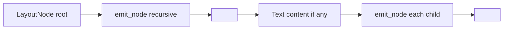

`layout_to_html` produces a single HTML file with one root div; each node is a positioned div with inline styles.

---

## 7. Key Data Structures

### AST (excerpt)

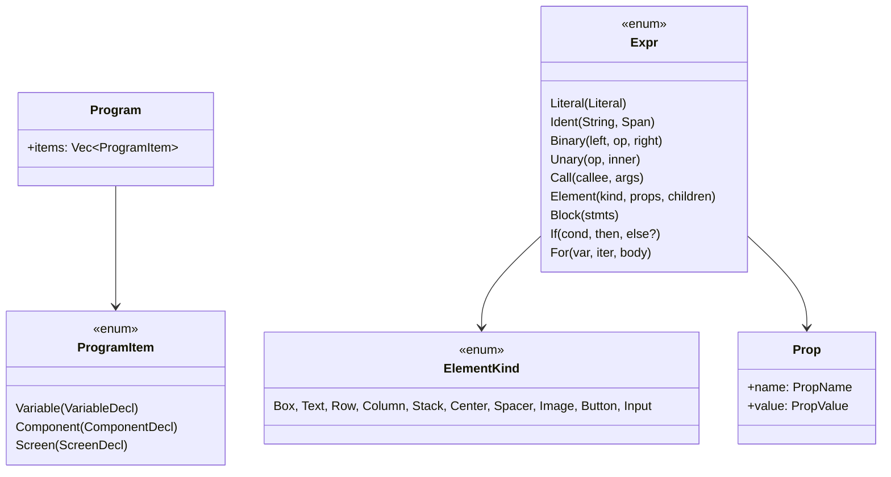

### Layout

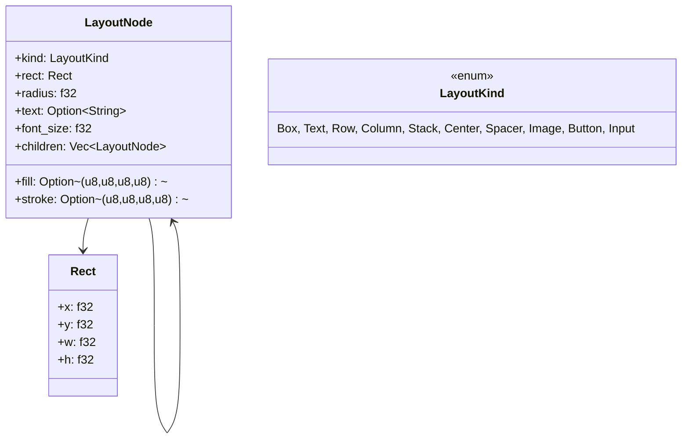

### Value & EvalContext

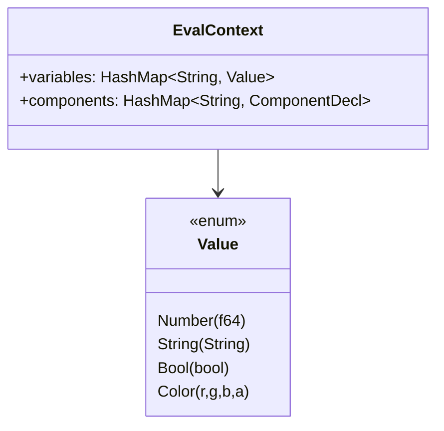

---

## 8. Example: End-to-End Walkthrough

Source (simplified):

```newt
let padding = 24;
screen Main {
  column { gap: 16, padding: padding } {
    box { fill: #ffffff, radius: 8 } {
      text { content: "Hello", fontSize: 24 }
    }
  }
}
```

### Step 1 — Lexer (conceptual token stream)

```
Let, Ident("padding"), Eq, Number(24), Semicolon,
Screen, Ident("Main"), LeftBrace,
Column, LeftBrace, Ident("gap"), Colon, Number(16), Comma, Ident("padding"), Colon, Ident("padding"), RightBrace, LeftBrace,
Box, LeftBrace, Ident("fill"), Colon, HexColor(255,255,255), Comma, Ident("radius"), Colon, Number(8), RightBrace, LeftBrace,
Text, LeftBrace, Ident("content"), Colon, String("Hello"), Comma, Ident("fontSize"), Colon, Number(24), RightBrace,
RightBrace, RightBrace, RightBrace, RightBrace,
Eof
```

### Step 2 — Parser

- **Program.items**: [ Variable(padding = 24), Screen(Main, body) ].
- **body** = `Expr::Element { kind: Column, props: [gap: 16, padding: ident "padding"], children: [ box_element ] }`.
- **box_element** = `Expr::Element { kind: Box, props: [fill: #fff, radius: 8], children: [ text_element ] }`.
- **text_element** = `Expr::Element { kind: Text, props: [content: "Hello", fontSize: 24], children: [] }`.

### Step 3 — EvalContext

- **variables**: `padding → Value::Number(24)`.
- **components**: (none).

### Step 4 — Layout (viewport 960×640)

1. **layout_tree(column, viewport)**  
   - padding = 24 (eval of ident "padding" → 24), gap = 16.  
   - inner = (24, 24, 912, 592).  
   - One child → one slot: (24, 24, 912, 592).

2. **layout_tree(box, (24,24,912,592))**  
   - fill = #ffffff, radius = 8.  
   - inner = same (no padding on box in this example).  
   - One child → (24, 24, 912, 592).

3. **layout_tree(text, (24,24,912,592))**  
   - text = "Hello", font_size = 24.  
   - children = [].

Result: root Column → one child Box → one child Text; all share the same rect; Box has fill/radius, Text has content/fontSize.

### Step 5 — Render

- **collect_rects**: one DrawRect for the Box (fill white, radius 8; stroke/radius not yet used in shader). Text node might add a rect only if it had a fill; here it doesn’t draw a rect in wgpu.
- Vertices for that rect are uploaded; render pass clears and draws.  
- **HTML**: root div 960×640; inside it a div for the column, then box, then text div with "Hello" and font-size.

---

## 9. How to View the Flowcharts

The diagrams in this file are written in **Mermaid**. You can view them in:

- **GitHub / GitLab**: paste this file in a repo; they render Mermaid in `.md` files.
- **VS Code**: install the “Markdown Preview Mermaid Support” extension, then open this file and use the markdown preview (e.g. `Ctrl+Shift+V`).
- **Notion**: create a code block, set language to `Mermaid`, and paste a single Mermaid diagram (one code block per diagram). Notion will render it.
- **Online**: copy a Mermaid code block into [mermaid.live](https://mermaid.live) to edit and export as PNG/SVG.

If you want this as a **single Notion page**: create a page, then paste each section and each Mermaid block (as a Mermaid code block) into that page for a one-place compiler guide.
