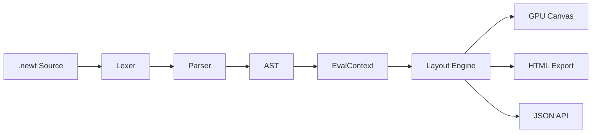

# Compiler Overview

The Newt compiler transforms `.newt` source files into rendered UIs. It uses a linear pipeline with five stages, all coordinated by a single `compile()` function.

## Pipeline

### 1. Lexer

The lexer reads the raw source text and produces a stream of tokens. It recognizes:

- **Numbers**: `16`, `3.14`
- **Strings**: `"Hello, world!"`
- **Colors**: `#2563eb`, `#f9fafb`
- **Keywords**: `screen`, `component`, `state`, `let`, `theme`, `use`, `import`, `if`, `else`, `for`, `in`, `range`, `true`, `false`
- **Element names**: `row`, `column`, `text`, `button`, `card`, and all other built-in elements
- **Operators and punctuation**: `(`, `)`, `{`, `}`, `:`, `,`, `+`, `-`, `*`, `/`, `==`, `!=`, `<`, `>`, `<=`, `>=`, `&&`, `||`
- **Identifiers**: variable names, component names, parameter names
- **Comments**: everything after `//` until the end of the line is discarded

### 2. Parser

A recursive descent parser consumes the token stream and produces an Abstract Syntax Tree (AST). The AST root is a `Program` node containing a list of items:

- `LetDecl` -- variable declarations
- `StateDecl` -- state declarations
- `ComponentDef` -- component definitions
- `ScreenDef` -- screen definitions
- `ThemeDef` -- theme definitions
- `ImportDecl` -- import statements
- `UseTheme` -- theme activation

Each element in the tree carries its name, props (key-value pairs), and children (nested elements or control flow nodes).

### 3. EvalContext

The evaluation context processes the AST in order:

- Registers `let` variables and their values
- Registers `state` variables with their initial values
- Records component definitions for later expansion
- Resolves `import` statements by loading and parsing the referenced files
- Applies `use theme` by merging theme variables into the current scope

When a screen is rendered, the EvalContext expands component calls, evaluates expressions, and resolves string interpolation.

### 4. Layout Engine

The layout engine takes the evaluated element tree and computes a spatial layout. Every element gets a `Rect` with four fields:

- `x` -- horizontal position in pixels
- `y` -- vertical position in pixels
- `w` -- width in pixels
- `h` -- height in pixels

The engine respects all layout props (padding, gap, grow, shrink, align, justify, width, height, constraints) and uses a flex-based algorithm for rows and columns, and a grid algorithm for grid elements.

The default viewport is **960 x 640 pixels**.

### 5. Render

The final stage produces output in one of two forms:

- **Canvas**: a wgpu-based window that draws the UI directly on the GPU. Used by the `newter-compiler` run command and the Canvas IDE.
- **HTML export**: a self-contained HTML file where each element becomes a positioned `
` with inline styles. Used by the `build --html` command.

## The compile() function

All consumers of the compiler -- the CLI runner, the `serve` command, the `build` command, and the LSP server -- use the same `compile()` entry point. This function takes source text and returns the fully laid-out element tree, ensuring consistent behavior across all output modes.

## Error handling

The compiler reports errors at each stage:

- **Lexer errors**: invalid tokens, malformed hex colors, unterminated strings
- **Parser errors**: unexpected tokens, missing braces, invalid syntax
- **Eval errors**: undefined variables, unknown components, circular imports
- **Layout errors**: constraint conflicts, invalid grid templates

Errors include the source location (line and column) so they can be displayed in the editor via the LSP server.

## Next steps

- [CLI Reference](/docs/compiler/cli) — all commands and flags for the Newt compiler.
- [HTML Export](/docs/compiler/html-export) — how Newt compiles to static and reactive HTML.
- [Canvas IDE](/docs/compiler/canvas-ide) — live-reload browser preview with hot module replacement.
