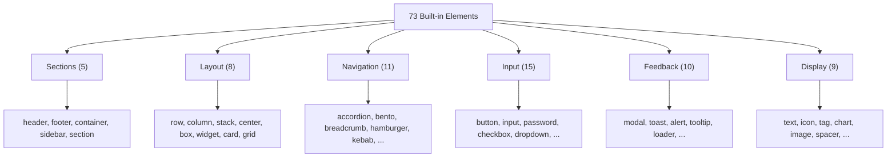

# Elements

Newt ships with 73 built-in elements organized into six categories. Every element can accept props and, where it makes sense, children.



## Sections

Structural containers that define the high-level regions of a page.

| Element     | Purpose                                    |
|-------------|--------------------------------------------|
| `header`    | Top-of-page banner, typically for branding and navigation |
| `footer`    | Bottom-of-page area for links and legal text |
| `container` | Width-constrained wrapper with padding     |
| `sidebar`   | Side panel for navigation or filters       |
| `section`   | Generic content section                    |

```newt
screen SectionsDemo {
    column()(
        header(fill: #1f2937, padding: 16)(
            text("My App", fontSize: 20, fontWeight: "700")
        )
        container(padding: 32)(
            section()(
                text("Main content goes here", fontSize: 16)
            )
        )
        footer(fill: #f3f4f6, padding: 16)(
            text("Copyright 2026", fontSize: 12)
        )
    )
}
```

## Layout

Primitives for arranging elements on screen.

| Element  | Purpose                                         |
|----------|-------------------------------------------------|
| `row`    | Horizontal flex container                       |
| `column` | Vertical flex container                         |
| `stack`  | Overlapping layers (z-axis stacking)            |
| `center` | Centers its children both horizontally and vertically |
| `box`    | Generic container with styling                  |
| `widget` | Self-contained interactive block                |
| `card`   | Styled container with stroke, radius, and padding |
| `grid`   | CSS-grid-style layout with columns and rows     |

```newt
screen LayoutDemo {
    column(gap: 16, padding: 24)(
        row(gap: 12)(
            box(fill: #e0e0e0, radius: 4)(text("Left"))
            box(fill: #e0e0e0, radius: 4)(text("Right"))
        )
        grid(columns: "1fr 1fr 1fr", gap: 8)(
            card(fill: #ffffff, stroke: #e5e7eb, radius: 8, padding: 12)(text("A"))
            card(fill: #ffffff, stroke: #e5e7eb, radius: 8, padding: 12)(text("B"))
            card(fill: #ffffff, stroke: #e5e7eb, radius: 8, padding: 12)(text("C"))
        )
    )
}
```

## Navigation

Elements for moving between views, sections, or pages.

| Element      | Purpose                                      |
|--------------|----------------------------------------------|
| `accordion`  | Expandable/collapsible content sections      |
| `bento`      | Grid-based navigation layout                 |
| `breadcrumb` | Hierarchical path indicator                  |
| `hamburger`  | Three-line menu toggle icon                  |
| `kebab`      | Vertical three-dot menu icon                 |
| `meatballs`  | Horizontal three-dot menu icon               |
| `doner`      | Stacked horizontal lines menu icon           |
| `tabs`       | Tabbed content switcher                      |
| `pagination` | Page number navigation                       |
| `linkList`   | Vertical list of navigable links             |
| `nav`        | Navigation bar container                     |

```newt
screen NavigationDemo {
    column(gap: 16, padding: 24)(
        nav(fill: #ffffff, stroke: #e5e7eb, padding: 12)(
            row(gap: 16)(
                text("Home", fontWeight: "600")
                text("About")
                text("Contact")
                spacer()
                hamburger()
            )
        )
        breadcrumb()(
            text("Home")
            text("Products")
            text("Details")
        )
        tabs()(
            text("Overview")
            text("Specs")
            text("Reviews")
        )
    )
}
```

## Input

Interactive elements that accept user input.

| Element       | Purpose                                    |
|---------------|--------------------------------------------|
| `button`      | Clickable action trigger                   |
| `input`       | Single-line text field                     |
| `password`    | Masked text field for passwords            |
| `search`      | Text field with search semantics           |
| `checkbox`    | Boolean toggle with a checkmark            |
| `radio`       | Single selection from a group              |
| `dropdown`    | Select from a list of options              |
| `combobox`    | Searchable dropdown                        |
| `multiselect` | Select multiple options from a list        |
| `datePicker`  | Calendar-based date selection              |
| `picker`      | Generic value picker                       |
| `slider`      | Range input with a draggable handle        |
| `stepper`     | Increment/decrement numeric input          |
| `toggle`      | On/off switch                              |
| `form`        | Groups inputs and handles submission       |

```newt
screen InputDemo {
    column(gap: 16, padding: 24)(
        input(placeholder: "Enter your name", stroke: #d1d5db, radius: 8, padding: 12)
        password(placeholder: "Password", stroke: #d1d5db, radius: 8, padding: 12)
        row(gap: 12)(
            checkbox()
            text("I agree to the terms")
        )
        row(gap: 12)(
            button("Submit", fill: #2563eb, radius: 8)
            button("Cancel", stroke: #d1d5db, radius: 8)
        )
    )
}
```

## Feedback

Elements that communicate status, confirmations, or progress to the user.

| Element         | Purpose                                   |
|-----------------|-------------------------------------------|
| `modal`         | Overlay dialog that blocks interaction    |
| `confirmDialog` | Modal with confirm/cancel actions         |
| `toast`         | Brief notification that auto-dismisses    |
| `notification`  | Persistent notification with actions      |
| `alert`         | Inline status message (info, warning, error) |
| `messageBox`    | Bordered message container                |
| `tooltip`       | Hover-triggered information popup         |
| `loader`        | Spinning or pulsing loading indicator     |
| `progressBar`   | Horizontal bar showing completion         |
| `badge`         | Small label for counts or status          |

```newt
screen FeedbackDemo {
    column(gap: 16, padding: 24)(
        alert(fill: #fef3c7, stroke: #f59e0b, radius: 8, padding: 12)(
            text("Warning: this action cannot be undone.", fontSize: 14)
        )
        row(gap: 12)(
            badge { content: "New", fill: #dbeafe }
            badge { content: "3", fill: #fee2e2 }
            badge { content: "Active", fill: #dcfce7 }
        )
        progressBar(fill: #2563eb, radius: 4)
        loader()
    )
}
```

## Display

Elements for presenting content that is not interactive.

| Element    | Purpose                                     |
|------------|---------------------------------------------|
| `text`     | Render a string of text                     |
| `icon`     | Display a named icon                        |
| `tag`      | Labeled chip for categories or filters      |
| `comment`  | Styled comment block with author context    |
| `feed`     | Scrollable list of content items            |
| `carousel` | Horizontally swipeable content viewer       |
| `chart`    | Data visualization (bar, line, pie)         |
| `image`    | Display an image from a URL or path         |
| `spacer`   | Flexible empty space that pushes siblings apart |

```newt
screen DisplayDemo {
    column(gap: 16, padding: 24)(
        text("Display Elements", fontSize: 24, fontWeight: "700")
        row(gap: 8)(
            tag { content: "Rust", fill: #fef3c7 }
            tag { content: "UI", fill: #dbeafe }
            tag { content: "Language", fill: #dcfce7 }
        )
        image(src: "https://example.com/hero.png", radius: 8)
        spacer()
        text("End of page", fontSize: 12)
    )
}
```

## Next steps

- [Props](/docs/language/props) — every prop with its type, default, and description.
- [Components](/docs/language/components) — define reusable UI blocks from elements.
- [Examples](/docs/examples) — full working programs that use elements in context.
