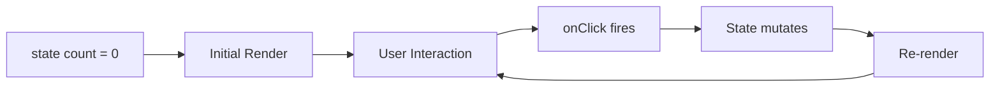

# State

State variables make your UI interactive. When a state variable changes, the compiler re-renders the affected parts of the screen automatically.



## Declaring state

Use the `state` keyword at the top level of your program:

```newt
state count = 0;
state name = "world";
state darkMode = false;
```

State variables can hold numbers, strings, or booleans. Each declaration ends with a semicolon.

## Updating state with onClick

The `onClick` prop runs an expression when an element is clicked. Inside `onClick`, you can assign new values to state variables:

```newt
state count = 0;

screen Counter {
    column(gap: 24, padding: 48)(
        text("Count: {count}", fontSize: 24)
        row(gap: 12)(
            button("+1", fill: #2563eb, onClick: { count = count + 1 })
            button("Reset", fill: #ef4444, onClick: { count = 0 })
        )
    )
}
```

When the user clicks "+1", the `count` variable increments by one, and the text element updates to show the new value.

## How re-rendering works

When a state variable is assigned a new value:

1. The compiler records the updated value.
2. All elements that reference the changed variable are re-evaluated.
3. The layout is recomputed and the screen is redrawn.

This happens synchronously and instantly. There is no virtual DOM diffing or batching -- the compiler re-renders from the current state on every change.

## String interpolation with state

State variables can be embedded in strings using curly braces:

```newt
state score = 0;

screen Game {
    column(gap: 16, padding: 32)(
        text("Score: {score}", fontSize: 32, fontWeight: "700")
        text("High score threshold: {score * 2}", fontSize: 14)
        button("Score!", fill: #10b981, radius: 8, onClick: { score = score + 10 })
    )
}
```

Expressions inside `{...}` are evaluated each time the state changes, so `{score * 2}` always shows double the current score.

## Multiple state variables

A program can have any number of state variables. Each one is independent:

```newt
state likes = 0;
state dislikes = 0;

screen Feedback {
    column(gap: 20, padding: 48, fill: #f9fafb)(
        text("Feedback", fontSize: 28, fontWeight: "700")
        row(gap: 16)(
            column(gap: 8)(
                text("Likes: {likes}", fontSize: 18)
                button("Like", fill: #2563eb, radius: 8, onClick: { likes = likes + 1 })
            )
            column(gap: 8)(
                text("Dislikes: {dislikes}", fontSize: 18)
                button("Dislike", fill: #ef4444, radius: 8, onClick: { dislikes = dislikes + 1 })
            )
        )
        text("Total votes: {likes + dislikes}", fontSize: 14)
    )
}
```

## State with conditional rendering

State works with `if/else` to show or hide parts of the UI:

```newt
state showDetails = false;

screen Product {
    column(gap: 16, padding: 24)(
        text("Product Name", fontSize: 24, fontWeight: "700")
        button("Toggle Details", fill: #2563eb, radius: 8, onClick: { showDetails = !showDetails })
        if showDetails {
            card(fill: #f9fafb, stroke: #e5e7eb, radius: 8, padding: 16)(
                column(gap: 8)(
                    text("Price: $29.99", fontSize: 16)
                    text("In stock: yes", fontSize: 16)
                    text("Ships in 2-3 days", fontSize: 14)
                )
            )
        }
    )
}
```

See [Control Flow](./control-flow.md) for more on conditional rendering.

## State vs let

| Feature      | `let`              | `state`                |
|--------------|--------------------|-----------------------|
| Mutable      | No                 | Yes                   |
| Triggers re-render | No           | Yes                   |
| Use case     | Constants, colors, labels | Interactive values |

Use `let` for values that never change (colors, labels, configuration). Use `state` for values that the user can modify through interaction.

## Next steps

- [Control Flow](/docs/language/control-flow) — use state values in conditionals and loops.
- [String Interpolation](/docs/language/string-interpolation) — embed state values in text with `{expr}`.
- [Examples](/docs/examples) — see state management in the counter and form examples.
